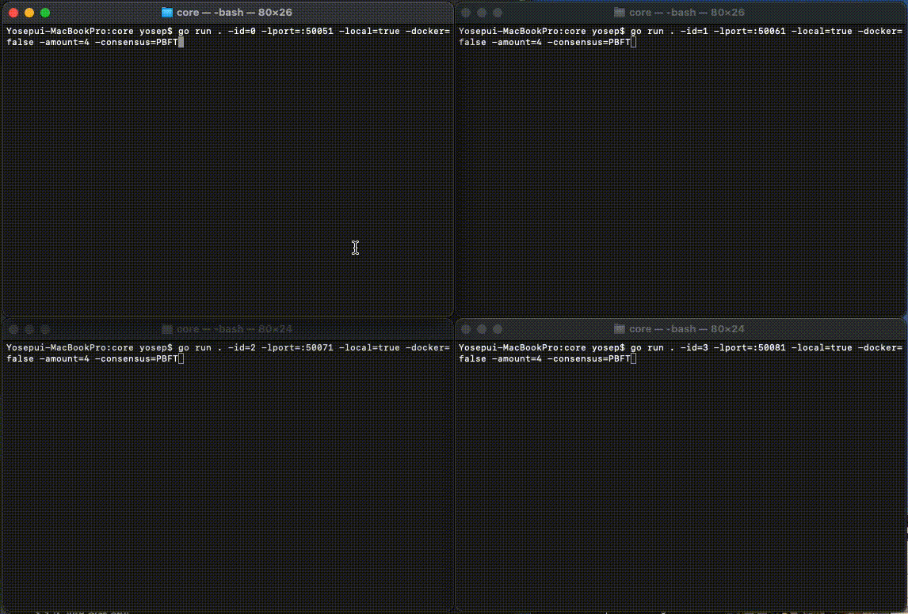
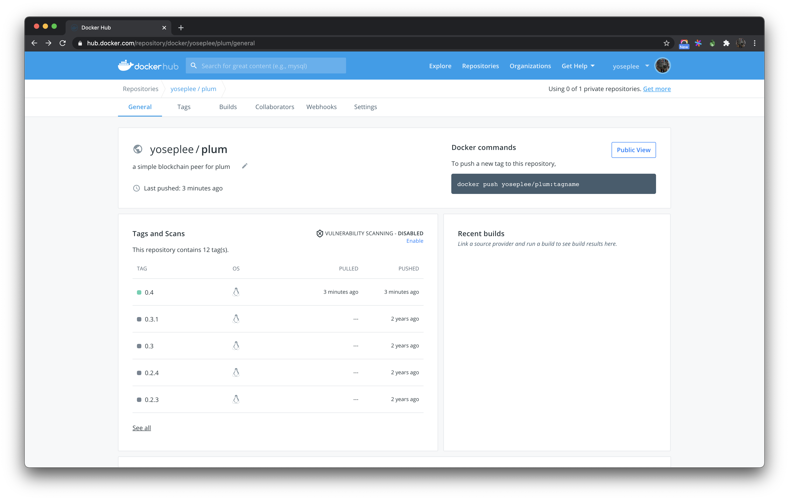
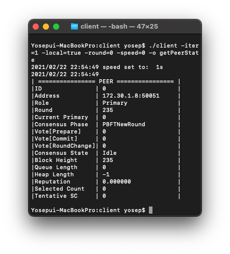

# PLUM
* PLUM은 합의 알고리즘 실험용 블록체인 노드입니다. 
* 이 레포지토리에 공개된 버전에는 PBFT(Practical Byzantine Fault Tolerance)와 제안 알고리즘(XBFT)이 구현되어 있습니다.
* 실행을 위해 go 1.11 이상이 필요합니다.

# 환경 변수 설정
* 실행애 앞서 아래와 같이 환경변수 설정이 필요합니다. 레포지토리 안에 포함된 genesis block을 읽어오는 등을 위해 필요합니다.
```
export PLUM_ROOT=<your plum project root>

# example
# export PLUM_ROOT=/Users/yosep/Documents/github.com/plum
```

# 실행
* PLUM의 실행은 아래와 같은 두 가지 방법으로 가능합니다.

1. 터미널을 통한 프로세스 실행
2. 도커를 통한 실행

* 대부분의 실행에 대해 '1. 터미널을 통한 프로세스 실행' 을 권장합니다. 
* 하지만 간단한 동작 확인을 위한 실행만이 목적이라면 '2. 도커를 위한 실행을' 권장합니다.

## 1. 터미널을 통해 프로세스로 실행
### 1.1. 로컬에서만 실행하는 경우(딘일 환경)
#### 1.1.1. 피어의 실행



* 아래 스크립트를 참고하여 위 그림과 같이 실행할 수 있습니다. 
* 아래 스트립트는 4개 피어를 실행할 때를 기준으로 합니다.

1. 총 4개의 터미널을 실행시키십시오
2. 레포지토리의 core 디렉토리로 이동하십시오
3. 아래 4개의 명령어를 각 터미널에 입력하십시오
4. 순차적으로 실행시키시되 5초 내로 모든 터미널을 실행시켜야 합니다.
5. 0번 피어에서 'consensus triggered!' 메시지가 출력되면 정상적으로 합의가 시작된 것을 의미합니다.

```shell script
# cd core/
go run . -id=0 -lport=:50051 -local=true -docker=false -consensus=PBFT -amount=4
go run . -id=1 -lport=:50061 -local=true -docker=false -consensus=PBFT -amount=4
go run . -id=2 -lport=:50071 -local=true -docker=false -consensus=PBFT -amount=4
go run . -id=3 -lport=:50081 -local=true -docker=false -consensus=PBFT -amount=4
```

#### 1.1.3. 피어 추가하기

* 4개 이상의 피어를 실행할 때는 실행하려는 피어의 수와 동일한 수량의 터미널을 수행시키고, 아래와 같이 명령어를 수정하여 실행하여야 합니다.
* 이 때, port는 10씩 증가하여야 합니다.

* 피어를 증가시킬 때는 반드시 컴퓨터의 가용 자원을 고려하여 실행되어야 합니다. 
* 컴퓨터가 멈추거나 타임아웃 메커니즘에 의해 합의가 정상적으로 이어지지 않는 경우가 발생할 수 있습니다.

```shell script
# cd core/
go run . -id=0 -lport=:50051 -local=true -docker=false -consensus=PBFT -amount=7
go run . -id=1 -lport=:50061 -local=true -docker=false -consensus=PBFT -amount=7
go run . -id=2 -lport=:50071 -local=true -docker=false -consensus=PBFT -amount=7
go run . -id=3 -lport=:50081 -local=true -docker=false -consensus=PBFT -amount=7
go run . -id=4 -lport=:50091 -local=true -docker=false -consensus=PBFT -amount=7
go run . -id=5 -lport=:50101 -local=true -docker=false -consensus=PBFT -amount=7
go run . -id=6 -lport=:50111 -local=true -docker=false -consensus=PBFT -amount=7
```

### 1.2. 분산 환경에서 실행하는 경우
#### 1.2.1. .env 파일 작성
* 분산 환경을 구성하는 컴퓨터의 프로파일을 /core/.env 파일에 작성해야 합니다. 
* 현재 최대 6개의 프로파일을 등록할 수 있습니다.

#### 1.2.2. 피어의 실행
* 피어를 실행할 컴퓨터 각각의 터미널에서 아래 명령어를 하나씩 수행합니다. 
* 예를 들어, 총 4대의 컴퓨터가 존재할 때 아래 4개 명령어를 각각 1개씩 수행합니다.
* 앞서 설명되어 있는 단일 환경과 마찬가지로 5초 내에 모든 피어가 시작되어야 합니다.

```shell script
# cd plum/core/
go run . -id=0 -local=false
go run . -id=1 -local=false
go run . -id=2 -local=false
go run . -id=3 -local=false
```

#### 1.2.3. 피어 실행 확인

* 앞선 1.1. 단일 환경의 경우와 마찬가지로 피어의 실행을 확인할 수 있습니다. 
* 단 이 때, client 디렉토리에 존재하는 .env 파일을 수정해야 합니다. 이는 client가 상태를 조회하고자 하는 피어의 프로파일을 명시하기 위함입니다.

```shell
# get peer state
# cd plum/core/client
go build .
./client -iter=1 -local=false -round=0 -speed=0 -target PLUM0 -o getPeerState
```

## 2. 도커를 통한 실행



* 도커 이미지는 https://hub.docker.com/r/yoseplee/plum 에 공개되어 있습니다. 
* 0.4 버전이 최신이며 이 레포지토리에 있는 모든 compose 파일은 0.4 버전을 기준으로 하고 있습니다.

### 2.1. startPlumNetwork.sh 를 통해 Docker-compose 실행

* compose/ 에 정의되어 있는 docker-compose 파일을 통해 실행할 수 있습니다.
* docker-compose 파일은 PBFT의 3f+1에 따라 4개, 7개, 10개, ... , 25개 까지 작성되어 있습니다.


 
* CONSENSUS=PBFT를 통해 합의 알고리즘을 PBFT로 설정할 수 있습니다. 
* 설정하지 않는 경우 기본 값인 제안 알고리즘(XBFT)가 설정됩니다.
* 단, 반드시 컴퓨터 유휴 자원을 고려하여 실행하십시오. 
* 컴퓨터가 멈추거나 타임아웃 메커니즘에 의해 합의가 정상적으로 이어지지 않는 경우가 발생할 수 있습니다.

```shell script
# docker-compose -f compose/"${PEERS}"-peers.yml up / down ${PEERS}
$ CONSENSUS=PBFT ./startPlumNetwork up 4
$ CONSENSUS=PBFT ./startPlumNetwork down 4
```

## 3. 피어 실행 확인



* 아래와 같은 명령어를 통해 피어의 상태를 조회할 수 있습니다.
* 이 경우 ID가 0번인 피어의 상태를 조회하게 됩니다.

```shell
# get peer state

# cd core/client
go build .
./client -iter=1 -local=true -round=0 -speed=0 -o getPeerState
```  

* 위 그림에서 나타난 피어의 상태에 대한 설명은 아래와 같습니다
    * ID: 
      * 피어에게 부여된 고유 ID를 의미합니다
      * 0 이상의 자연수입니다
    * Address: 
      * 피어의 IPv4:Port 를 의마합니다
    * Role: 
      * 합의에서 피어의 역할을 의미합니다
      * 다음과 같은 세 가지 역할이 있습니다
        * Primary
        * Backup
        * CommitteeMember
    * Round: 
      * 합의 라운드를 의미합니다
      * Round Change가 발생하지 않은 경우 Block Height과 동일합니다
    * Current Primary: 
      * 현재 Primary 역할을 수행하는 피어의 ID를 의미합니다
    * ConsensusPhase: 
      * 현재 처리 중인 합의 Phase를 의미합니다
    * Vote[Phase]: 
      * 해당 단계에서 합의 진행을 위해 수집한 메시지의 수를 의미합니다
    * Consensus State: 
      * 합의에서 피어의 상태를 의미합니다 - 현재 기능하지 않습니다
    * Block Height: 
      * 블록의 높이를 의미합니다
    * Queue Length: 
      * 메시지 큐에 존재하는 메시지의 수를 의미합니다
    * Heap Length: 
      * 현재 처리 중인 단계보다 앞선 단계에서 발생하여 수신한 메시지의 수를 의미합니다.
    * Reputation: 
      * 노드의 평판 점수를 의미합니다
      * XBFT의 경우에만 1.0으로 초기화 됩니다
    * Selected Count: 
      * 위원회에 선발되고, 블록 발행까지 완료한 횟수를 의미합니다
    * Tentative SC: 
      * 위원회에 선발된 횟수를 의미합니다
    

# 3. 기타 참고 사항
## 도커 이미지 빌드
* 도커를 통해 실행하기 위해서 /images/peer/Dockerfile 을 수정한 후 아래 쉘 명령을 수행하여 도커 이미지를 빌드하세요.

```shell script
# at the project root
$ docker build --tag yoseplee/plum:0.4 -f images/peer/Dockerfile .
```

## protocol buffer 컴파일
```.env
# example 
# protoc -I helloworld/ helloworld/helloworld.proto --go_out=plugins=grpc:helloworld

# cd plum/
protoc -I proto/ proto/plum.proto --go_out=plugins=grpc:core/plum/
```